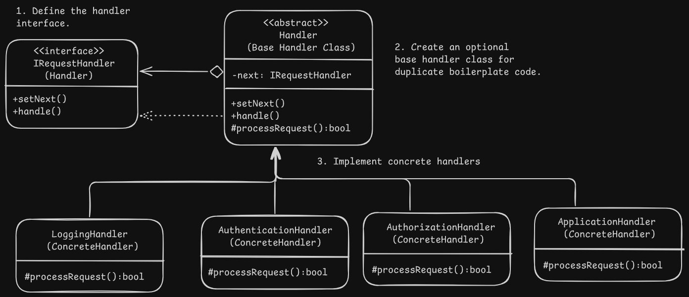

# Chain Of Responsibility/CoR/Chain Of Command Design - Web Server Request Processing

# Overview
- It lets us pass requests along a chain of handlers which decide either to process the request or pass it to the next handler in the chain.

# Problem
- When performing multiple operations on requests makes the code messier with each newly added operation and operations impact each other and reuse might not directly be possible.

# Solution
- Chain of responsibility relies on transforming particular behaviours as stand alone objects called handlers.
- Handlers are linked in a chain with a reference to the next handler in each handler.
- A handler can decide whether to stop any further processing.
- In an alternative approach, if a handler can process the request it does the same and doesn't pass the request any further.
- All handler classes should implement the same interface and concrete handlers should only care about implementing their method to process the request.
- Since all handlers implement the same interface, chains can be composted at runtime without coupling with concrete handler classes.

# Applicability
- When the program is expected to process different kinds of requests in various ways but the exact type of request and their sequences are unknown beforehand, so relevant handlers which can process the given request will do it as required or pass it further down the chain.
- When the request should go through several handlers in a particular order.
- When the set of handlers and their order might change at runtime.

# Implementation
1. Declare the handler interface and the signature of the methods to handle the requests. Pass the request as an object to the handling method as an argument.
2. If there is a lot of duplicate boilerplate code in the concrete handlers, move it to an abstract base handler class derived from the handler interface. The base handler class usually contains the reference to the next handler and it's setter and default handle behaviour to forward the request to the next object.
3. Implement concrete handlers and their handling methods which also decide whether to process the request or pass it.
4. Client can assemble the chain or recieve pre-built chains from some factory class based on environment or configuration.
5. Any handler in the chain may be invoked and it may be passed another handler or reach the end of chain.
6. Edge cases such as single link in chain, request not reaching end of chain or request reaching end of chain unhandled should be covered.

# Benefits and Pitfalls
Benefits:
- Order of request handling can be controlled.
- Single Responsibility Principle : Classes that invoke operations can be decoupled from the classes that perform the action, otherwise class invoking the operation has to know about the class that does the action.
- Open/Closed Principle : New handlers can be added without breaking existing client code.

Pitfall:
- Some requests may go unhandled.

# Relation with Other Patterns
- Chain of Responsibility is often used with Composition, where a leaf component gets the request it may be passed through all the parent components of the object tree.
- Chain of Responsibility and Decorator pattern have similar structures as both rely on recursive composition to pass the execution through a series of objects. Handlers can execute arbitrary operations independent of each other and can stop processing the request further, while decorators extend the objects behaviour while keeping it consistent with the interface and they can't break the flow of the request.