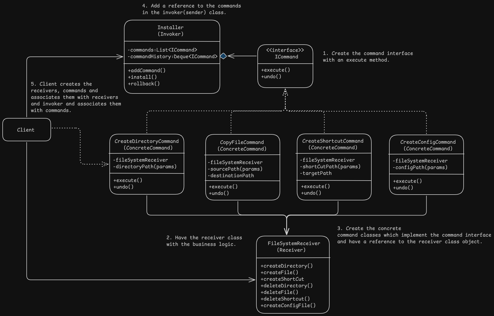

# Command/Action/Transaction Pattern Design - Software Installer

# Overview
- It lets you represent requests as stand-alone objects with all information about the request. This allows you to pass the request as method arguments, delay or queue the reqeust's execution or support different operations such as undo/redo.

# Problem
- Tight coupling between the class invoking the request and the receiver of the request which performs the business logic.
- It leads to poor separation of concerns, lack of reusability, and code duplicate and inflexibility.

# Solution
- Invoker shouldn't directly send the request but extract all the request details such as object being called, method name and list of arguments, etc into a separate command class with an execute method to trigger the request.
- Command objects serve as a link between the invoker and the business logic, decoupling the invoker from the receiver.
- Commands should implement the same interface usually with an execute method with no parameters. Various commands can be used with the same request sender while keeping it decoupled from the concrete command classes using the interface. It also allows switching og commands at runtime to change the senders behaviour.
- Commands should be pre-configured with the request parameters or be able to get the data on it's own.

# Applicability
- When we want to send operations i.e specific method calls as parameters to objects, command class objects can be used to parameterize the method calls.
- When we want to queue operations, schedule execution or execute the commands remotely as command objects can be serialized and stored for later use or for sending them over network.
- When we want to implement reversible operations using the commands history stack either by saving the state or executing inverse operations if possible. The drawbacks to this are that it might not be easy to store the state and backups may consume large amount of RAM and reverse operations might not be possible or hard to implement.

# Implementation
1. Declare the command interface with an execute method.
2. Start extracting requests into command classes that implement the command interface. All concrete classes should have the fields for storing the request arguments eith a reference to the actual receiver object and all these values must be initialized by the constructor.
3. Identify sender/invoker classes and add a reference to the command interface to store the command. Senders usually get the command objects from the client code.
4. Change the senders to invoke the command instead of calling the request methods directly.
5. Client creates the receivers, commands with associations to respective receivers and invokers and their respective associations with the respective commands in this order.

# Benefits and Pitfalls
Benefits:
- Single Responsibility Principle: Classes that invoke the operations are decoupled from the classes that perform the operations.
- Open/Closed Principle: New commands can be added without breaking the existing client code.
- Undo/redo functionalities can be added.
- Command execution can be deferred as required to schedule/delay actual execution.
- Set of simple commands can be assembled into a complex command.

Pitfalls:
- Code becomes complicated as an extra layer is added between senders and receivers.

# Relation with Other Patterns
- Chain of Responsibility and Command pattern address various ways of connecting senders and receivers:
    - Chain Of Responsibility: It passes the request sequentially along a dynamic chain of receivers until one of them handles it.
    - Command establishes unidirectional connection between sender and receivers.

- Handlers in Chain Of Responsibility can be implemented as commands so we can execute different operations over the same request (middlewares) OR the request itself could be a command object and we can execute the same operation/command with different handlers linked in a chain (passing down the same request/command to different handlers).

- Prototype can be used to save copies of commands into history.