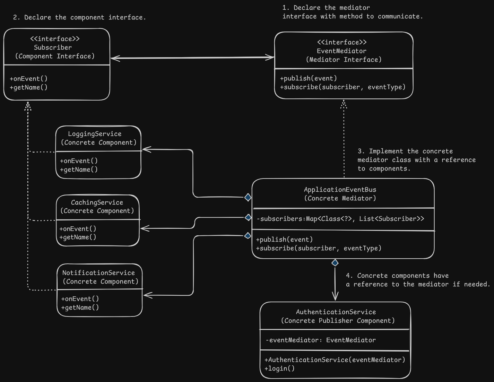

# Mediator/Intermediary/Controller Pattern Design - Event Bus/Pub-Sub Model

# Overview
- It lets you reduce chaotic dependencies between objects by restricting the direct communication between objects and forcing them to communicate via a mediator object.

# Problem
- When many components are communicating directly, it creates tight coupling between them and it leads to poor reusability.

# Solution
- This pattern suggests that you cease all direct communication between components that have to be made independent.
- These components must collaborate indirectly by calling a special mediator object that redirects the calls to the appropriate components. Components now only depend on the single mediator class.
- This dependency can be further loosened by extracting a common interface for the mediator so the components work with any mediator that implement the interface.
- This leads to fewer dependencies which makes the class easier to extend, reuse and modify.

# Applicability
- When it's hard to change some of the classes because they are tightly coupled to other classes.
- When we can't reuse a component because it's too dependent on other components.
- When we need to create tons of component subclasses to reuse some basic behaviour in various contexts which can be done by introducing new mediators without having to change the component themselves.

# Implementation
1. Identify the group of tightly coupled classes that can be made dependent and define a common component interface for them if applicable.
2. Declare the mediator interface and describe the desired communication method between mediators and components, usually it is a single notify method but is application specific. The interface is crucial to reuse components in different contexts by swapping different implementations of the mediator.
3. Implement the concrete mediator class with a reference to all components it manages.
4. Mediator may be responsible for creation and destruction of components.
5. Components mostly have a reference to the mediator which is initialized in the components constructor.
6. Update the components to call the mediator's method instead of calling other components directly and extract this code and move it to the mediator to handle the request.

# Benefits and Pitfalls
Benefits:
- Single Responsibility Principle : Communications between various components can be extracted into a single place, making it easier to comprehend and maintain.
- Open/Closed Principle : New mediators can be added without changing the actual components.
- Coupling between the components can be reduced.
- Enables reuse of individual components.

Pitfalls:
- Overtime, mediator may evolve into a god class.

# Relation with Other Patterns
- Chain Of Responsibility, Command and Mediator address various ways of connecting senders and receivers:
    - CoR passes a request sequentially along a dynamic chain of potential receivers until one of them handles the request.
    - Command establishes unidirectional connection between the sender and receiver.
    - Mediator eliminates direct communication and forces them to communicate indirectly via the mediator object.

- Facade and Mediator have similar jobs: they try to organize collaboration between lots of tightly coupled classes.
    - Facade defines a simplified interface to a subsystem of objects, which itself is unaware of the facade. Objects within the subsystem can communicate directly.
    - Mediator centralizes the communication between components of the system and they only know about the mediator and don't communicate directly.