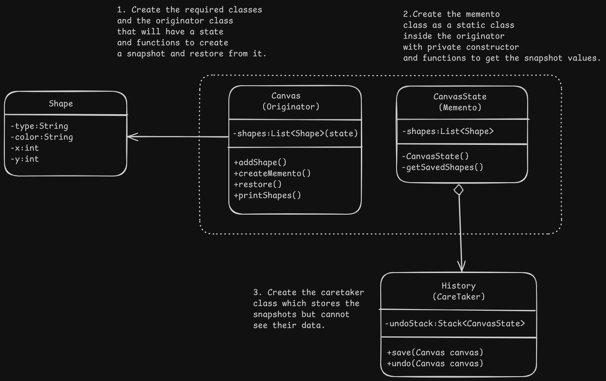

# Memento/Snapshot Pattern Design - Basic Figma Canvas

# Overview
- It lets you save and restore the previous state of an object without revealing the details of it's implementation.

# Problem
- Violation of encapsulation: To create a copy of the state of the objects, it's private fields would need to be made public.
- Making the objects public can lead to tight coupling and fragile code, where changes to some fields might break or require changes in many other classes.

# Solution
- Memento pattern delegates the creation of the state snapshots to the actual owner of the state i.e the "originator" object. It can do so as it has access to all the private states as opposed to an outside object.
- The copy of the state is stored in a special object called memento. The contents aren't accessible to any other object but they may interact with the memento using an interface to get it's metadata such as creation time, operation, etc.
- With this restriction policy, mementos can be stored in other objects called caretakers, which cannot modify their state but only interact with their metadata via the interface.

# Applicability
- When you want to create snapshots of the object's state to be able to restore a previous state of the object. It is particularly known for the undo feature but also widely used dealing with transactions.
- When direct access to the object violates it's encapsulation as memento makes the object itself responsible for the snapshot creation.

# Implementation
1. Determine what class will become the originator, it could be one central class or multiple smaller one's.
2. Create the memento class and mirror the fields declared inside the originator class.
3. Memento object should be immutable i.e accepts data only via constructor and has no setters.
4. If nested classes are supported add the memento class to the originator class. Otherwise create an interface for the memento and make all other objects use the interface to refer to the memento. The interface may have metadata operations.
5. Add a method to create the snapshots/mementos in the originator class. Originator should pass it's state to the memento constructor via arguments.
6. Add a method to restore the state in the originator class. It should accept a memento object as an argument.
7. Create the caretaker and whether it's represented by a command, history or something entirely different, it should know when to request new mementos, how to store them and when to restore the originator with a particular memento.
8. The link between caretakers and originators may be moved to the memento class where memento class must be connected to the originator that had created it. The restore method would also be moved to the memento class. This only makes sense if memento is inside the originator class or originator class provides sufficient setters for overriding it's state. (Implementation with even stricter encapsulation).

# Benefits and Pitfalls
Benefits:
- Snapshots of the objects can be created without violating it's encapsulation.
- Originator's code can be simplified by letting the caretaker manage the history of the code.

Pitfalls:
- It might lead to high RAM usage if too many snapshots are created.
- Caretakers need to track the originator's lifecycle to be able to destroy obsolete mementos.
- Many dynamic programming languages such as PHP, JavaScript can't guarantee that the state of the memento stays untouched.

# Relation with Other Patterns
- We can use command and memento together when implementing undo. In this case, commands are responsible for performing various operations over a target object while memento saves the state of that object before the command is executed.
- Memento can be used with iterators to capture current iteration state and rill it back if needed.
- When dealing with straightforward object states that have to be stored in history, prototype may be a simpler alternative to memento. These states usually don't have links or external resources or the links are east to re-establish.