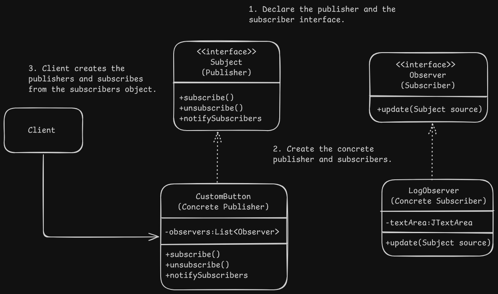

# Observer/Event-Subscriber/Listener Pattern Design - GUI Event Handling

# Overview

# Problem

# Solution

# Applicability

# Implementation

# Benefits and Pitfalls

# Relation with Other Patterns
