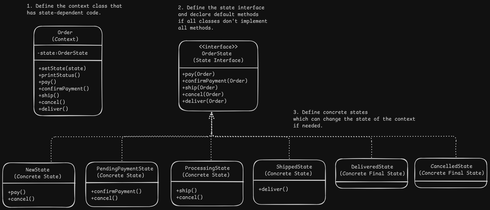

# State Pattern Design - Ecommerce Order

# Overview
- It let's an object alter it's behavior when it's internal state changes as if the object changed it's class.

# Problem
- There's a finite number of states which a program can be in and it may or may not switch to another state depending on it's current state. These switching rules are called transitions which are finite and pre-determined.
- When such a state machine is implemented using conditionals which update the object's fields based on the required state, it becomes very difficult to maintain the code because it will contain huge number of conditionals and change to the transition logic may require changing state conditionals in every method.

# Solution
- The pattern suggests to create new classes for each state which follow the same interface retracted from all the state specific behaviours.
- The original object called context stores a reference to the state object to represent it's current state and delegates all state related work to that object.

# Applicability
- When you have an object that behaves differently depending on it's current state, the number of states is enormous and the state-specific code changes frequently.
- When classes have massive conditionals to alter their behaviour according to the current value in class's fields.
- When you have a lot of duplicate code across similar states and transitions of a conditional state machine.

# Implementation
1. Define the context class which could be an existing class if it has all the state-dependent code or a new class if state-specific code is distributed across multiple classes.
2. Declare the state interface which contains state-specific behaviours.
3. For each state, create a new class that implements the interface and move the code related to that particular state from the context class to this class.
4. If the code depends on the private members of the context, make the fields/methods public or nest the state class in the context class.
5. Add a reference field of the state interface in the context class and a public setter to allow changing the state.
6. Replace empty conditionals with a call to the corresponding method of the state objects.
7. Switching/transition can be done from the context itself, different states or the client using an instance of the required state and passing it to the context state setter.

# Benefits and Pitfalls
Benefits:
- Single Responsibility Principle : State code is organized in their respective classes.
- Open/Closed Principle : New states can be added without changing existing state classes or context.
- Simplification of code by eliminating bulky state machine conditionals.

Pitfalls:
- Overkill for few states or rarely changing states.

# Relation with Other Patterns