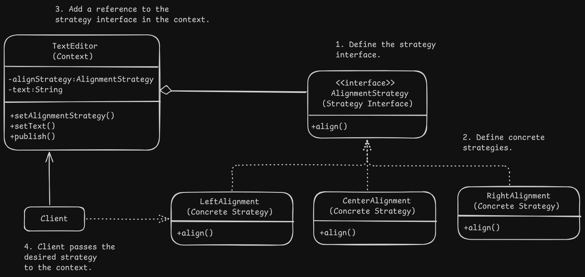

# Strategy Pattern Design - Text Editor

# Overview
- It lets you define a family of algorithms, put them into a separate class and make their objects interchangable.

# Problem
- Violation of Open/Closed Principle : All new algorithms are added to the same class for the new functionality which affects existing code.
- Large monolithic class : When all different variants of the algorithm are crammed together in a single class, it has too many responsibilities.
- Tight coupling and fragile code : All different algorithms are tightly coupled in a single class.

# Solution
- This pattern suggests that when a class does something in many different ways, we can extract all of the these different algorithms in separate classes called strategies.
- The original class called context has a reference to these classes to delegate the work to a linked strategy.
- The desired strategy is passed to the context by the client and the context deals with a generic interface for all strategies and is independent of the concrete strategies.
- The strategy interface allows to add new strategies or modify existing strategies without changing the code of the context.

# Applicability
- When you want to use multiple variants of an algorithms in a single context object and switch from one algorithm to another during runtime.
- When we have a lot of classes that only differ in execution behaviour.
- When we want to isolate the business logic from the implementation details of the algorithm and allow switching of algorithm at runtime.
- When we have a massive conditional operator that switches between different variants of the same algorithm.

# Implementation
1. Identify the context class which executes different variants of the algorithm.
2. Declare the strategy interface common to all the variants of the algorithm.
3. Extract all algorithms into different concrete strategy classes that implement the above interface.
4. In the context class, store a reference to the strategy interface and provide a setter to set the strategy.
5. Clients of the context must link the suitable strategy that matches the way they expect the context to perform it's primary job.

# Benefits and Pitfalls
Benefits:
- Algorithms can be swapped at runtime.
- Implementation details of an algorithm can be isolated from the client code.
- Inheritance is replaced with composition as different subclasses of different variants of same algorithms can be moved to different independent classes.
- Open/Closed Principle : New strategies can be added without having to change the context.

Pitfalls:
- Overkill for less number of algorithms that rarely change.
- Clients need to be aware of all the strategies.
- Many modern programming languages support implementing different version of an algorithm inside a set of anonymous functions. These function can be used exactly as the strategy objects without adding extra classes or interfaces.

# Relation with Other Patterns
- Bridge, State, Strategy and to some degree Adapter have similar structures. All are based on composition and delegating the work to other objects. However all of them solve different problems so the patterns communicate different problems that they solve rather than the structure of the code.
- Command and Strategy may look similar as both parameterize objects that have some actions such as operations in command or set of algorithms in strategy, but both have different intents:
    - Command converts any operation into an object and the parameters of the operation become fields of the object. This conversion is used to defer execution, queue it or send commands to remote services, etc.
    - Strategy usually describes different ways or variants of the same thing allowing you to swap these algorithms in a single context class.

- Decorator lets you change the skin of the object i.e add additional behaviours, while Strategy lets you change the guts, i.e the core set of algorithms.
- State can be considered an extension of Strategy. Both are based on composition and change the behaviour of the class by delegating to different objects. Strategy makes these objects completely independent and unaware of each other while state doesn't restrict dependencies between concrete states and allows one concrete state to change the object to a different state. 
