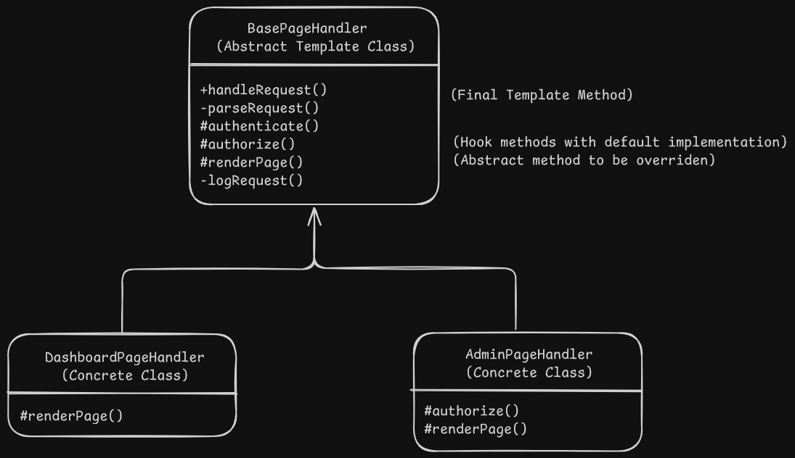

# Template Method Pattern Design - Web Application Framework HTTPRequestHandler

# Overview
- It defines the skeleton of an algorithm in the superclass but lets subclasses override steps of the algorithm without changing it's structure.

# Problem
- When multiple classes have a lot of duplicated code along with some code specific to that class.
- When the client has a lot conditionals to choose the proper course of action depending on the class of the object.

# Solution
- The pattern suggests to break down an algorithm into a series of steps and turn these steps into methods and call these methods from a single template method.
- Steps may either be abstract or have some default implementation.
- Client provides the subclass which implements the abstract methods and override the default methods if required but never the template method itself.
- There's another type of step called hooks which is an optional step with an empty body. Template method works even if hooks are not implemented. Usually they are placed before and after crucial steps of the algorithms to provide sublcasses with the option to add additional points for an algorithm.

# Applicability
- When you want to let clients extend only particular steps of an algorithm but not the whole algorithm or it's structure.
- When you have several classes that contain almost identical algorithms with some minor differences.

# Implementation
1. Identify the target algorithm, the common steps in the algorithm and unique steps for subclasses.
2. Create the abstract base class and declare the template method and set of abstract methods representing the algorithm's steps. Outline the structure by executing the steps in the required order in the template method. Make the template method final so it cannot be overriden.
3. Create common step methods with default implementations if any exist.
4. Verify if hooks can be added between crucial steps of the algorithms.
5. For each variation of the algorithm, create new concrete subclasses. It must implement all abstract methods, but may override some default implementations.

# Benefits and Pitfalls
Benefits:
- Clients can override certain parts of a large algorithm, making them less affected by changes in other parts of the algorithm.
- Duplicate code can be pulled in the superclass.

Pitfalls:
- Some clients may be limited by the provided skeleton of the algorithm.
- LSP might be violated by suppressing a default step implementation in a subclass.
- Template methods may be harder to maintain if they have more steps.

# Relation with Other Patterns
- Factory method is a specialization of the template method and it may also be implemented as a step in a large template method.
- Template method is based on inheritance while strategy pattern is based on composition and both allow to alter the behaviour of some class. Template method works at class level so it's static while strategy works on object level, letting you switch behaviour at runtime.
