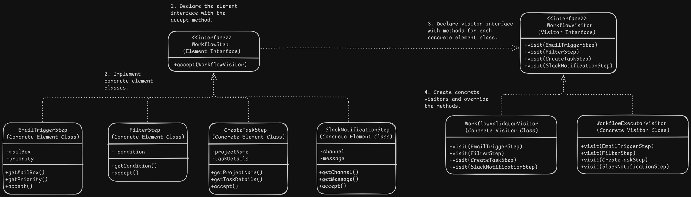

# Visitor Pattern Design - Workflow Automation Steps

# Overview
- It lets you separate algorithms from the objects on which they operate.

# Problem
- Violation of Single Responsibility Principle : The algorithm might not be directly related to the objects responsibilities so adding an unrelated algorithm to the object might violate Single Responsibility Principle.
- Adding new algorithms to existing classes violates open/closed principle.
- It leads to tight coupling between the class and the operations that work on the class data but are not directly related to it.
- Adding new operations to a complex object structure required modification to all classes leading to a system that is fragile and hard to maintain.

# Solution
- The pattern suggests to place the new behaviour into a separate class called visitor. Pass the data object as a parameter to the visitor method.
- If the behaviour can be executed over objects of different classes, visitor class may define not one but multiple methods which takes different class objects as arguments.
- Visitor pattern uses a technique called Double Dispatch, where the classes themselves call their visitor method and pass their object as arguments.

# Applicability
- When we need to perform an operation on all elements of a complex object structure.
- When we need to clean up the business logic of auxillary behaviours by extracting all other behaviours into set of visitor classes.
- WHen a behaviour only makes sense in some classes of a class hierarchy but not in others.

# Implementation
1. Declare the element interface with the accept method or when working with existing class hierarchies add an abstract accept method in the base class. The method accepts a visitor object as an argument.
2. Implement the acceptance methods in each concrete element class and redirect the call to the visiting method of that particular class and pass the current object.
3. Declare the visitor interface with a set of methods, one per each concrete element classes.
4. The element classes work the visitor only via the interface but visitors know all the concrete element classes as they are referenced in the parameter objects.
5. For each new behaviour, create a new visitor class and add all the visiting methods for each concrete class.
6. Client creates the visitor objects and passes them into elements via accept methods.

# Benefits and Pitfalls
Benefits:
- Open/Closed Principle: New behaviour can be added that works with different classes without changing these classes.
- Single Responsibility Principle: Multiple versions of same behaviour exist in the same visitor class.
- Easy to traverse complex object structures and collect information from each object by visiting it.

Pitfalls:
- All visitors need to be updated when a class get added or removed.
- Visitors might lack necessary access to the private fields and methods of the elements they are working with.

# Relation with Other Patterns
- Visitor can be treated as a powerful version of the Command Pattern. It's objects can execute operation on various objects of different classes.
- Visitor can be used on all objects in a composite tree.
- Visitor can be used with iterators to traverse complex object structure and perform some operation over all objects even if they belong to different classes.