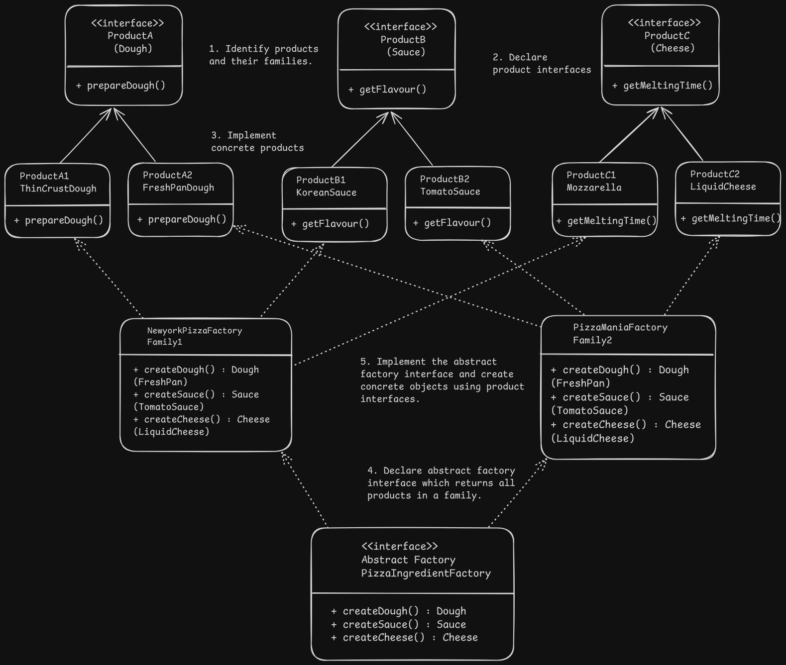

## Abstract Factory Design - Pizza Restaurant

# Overview
- Produces families of similar/related/dependent objects without specifying their concrete classes.
Examples:
- Family = Chair + Sofa + CoffeeTable or Button + CheckBox + Window or iOS Components + Android Components
- Each family will have certain type of products as we can have different types of furniture or different elements based on OS.

# Problem
- If there is high coupling between object creation, existing code will require a change everytime a new family is added or a new object is added which violates open/closed principle.
- Objects should match with other objects of same family.

# Solution
- Move the object creation logic to a dedicated factory class which implements the abstract factory interface and returns all objects belonging to the same family.
- Client code shouldn't care about the variant and work with the individual product interfaces implemented by all variants.

# Applicability
- When we have a set of factory methods in our code, it is a good candidate for Abstract Factory.
- When the exact variant type might not be known before-hand such as environment, etc. and we want to allow for extensibility.

# Implementation
1. Identify distinct products and their types.
2. Declare product interfaces for distinct product types and have all their concrete product classes implement the interface.
3. Declare abstract factory interface which creates objects of the product interface types for all products.
4. Implement concrete factories for a family and implement the abstract factory interface.

# Benefits and Pitfalls
Similar to factory method pattern.

# Relation with Other Patterns
- It is an extension of Factory method as many designs start with it and evolve towards this pattern.
- Abstract factory classes are often based on a set of factory methods.