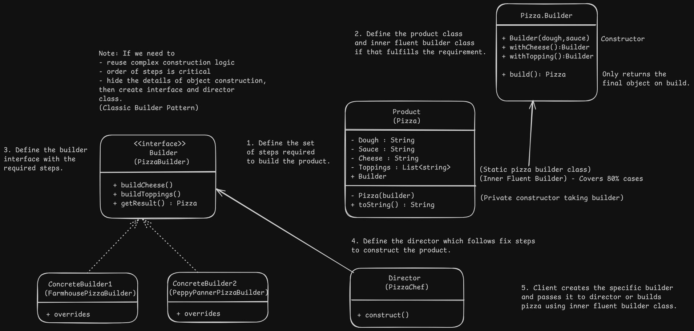

## Builder Design - Pizza Restaurant

# Overview
- Constructs complex objects step by step and allows to produce different kinds of objects with same code if the steps to create them are same. Ex- PDF, Word, HTML builder.

- Real Use Cases: StringBuilder, WebApplicationBuilder, etc.

- Inner Fluent Class : Another class inside the object with different steps that can be chained to create the object and build to get the final result.

# Problem
- Complex object creation with many possible different extensions on top of the base object.

# Solution
- Move object construction to a builder object which can execute a series of steps to create the required objects and it can return different types of unrelated objects using getResult or build.
- Different concrete builder classes can execute same steps as the builder interface but create different objects using same steps.
- Optional director class can be used to define the order of the steps or reuse complex object creation logic.

# Applicability
- When there are a huge number of parameters in the constructor.
- To avoid telescopic constructors i.e multiple different constructors with different kind of parameters.
- When we need different types of variants of the same product with modifications.

# Implementation
1. Define the common construction steps required to build all product variants.
2. Define the product class and inner fluent builder class if that completes all requirements.
3. Define the builder interface with the required steps.
4. Implement concrete builders with the builder interface and return the required products.
5. See if director is required to encapsulate fixed ways to construct the product.
6. Client can create the required builder and pass it to director or use fluent builder with chained methods to build the required object.

# Benefits and Pitfalls
- Same construction code can be used for different products if they follow the same steps for creation.
- Single Responsibility Priniciple : Complex construction logic is isolated from the business class.

# Relation with Other Patterns
- Abstract factory returns the object immediately whereas builder class can return intermediate builder objects and invoke additional steps before returning the final result.