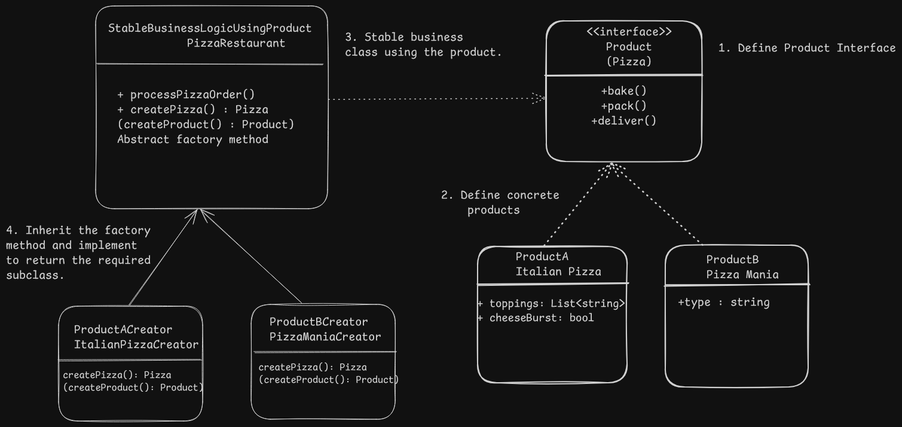

## Factory Method Design - Pizza Restaurant

# Overview
Provide an interface for creating objects in a superclass and allow subclasses to alter the types of objects.

# Problem
- High coupling between the concrete product classes and the client code which uses these objects and is responsible for creating the required objects.
- It violates the single responsibility principle as the class is now also responsible for object creation along with core business logic.
- If a new class is added, the stable business logic has to be modified which violates open/closed principle.

# Solution
- Delegate the responsibility of creating the objects to a factory method which returns different types of object belonging to the same interface i.e return type of the factory method.
- Different subclasses override the factory method and create the required objects without impacting the base business class logic.

# Applicability
- It can be used when the object types are not known beforehand and might vary during runtime based on user input, environment, etc.
- It provides an easy way to extend internal components in libraries/frameworks.
- It can be used when dealing with reuse of existing objects such as connection pools, etc.

# Implementation
1. Define the interface for the different objects and implement their concrete classes.
2. Create an abstract factory method in the business logic/super class which returns the interface object.
3. Inherit the superclass and override the factory method to return the required objects and use them as required.

# Benefits and Pitfalls
Benefits: Follows single responsibility and open/closed principle.
Pitfalls: Code complexity increases as it uses a lot of subclasses to implement the pattern.

# Relation with Other Patterns
NA