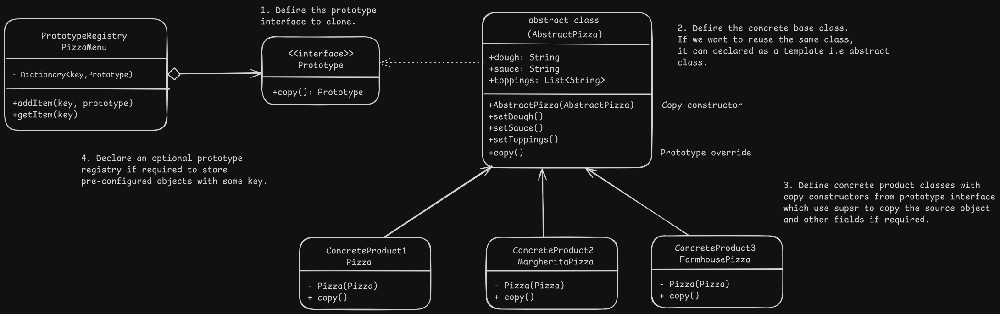

## Prototype Design - Pizza Restaurant

# Overview
Prototype
- It allows to create new objects by cloning existing objects also know as prototypes.
- It clones the objects without coupling the concrete class using an interface with clone method and copy constructor in concrete classes.

# Problem
- We cannot directly copy values by creating a new class object as some values might be private.
- It creates a dependency between the concrete class as exact object type has to be known.
- Exact type of the object might not be known if we are dealing with interfaces.

# Solution
- Cloning of the objects is delegated to the class of the objects being cloned.
- All objects that support cloning implement a Prototype interface which contains a copy method.
- Object class is decoupled as interface is used to create a copy.

## Prototype Registry:
- An optional registry class can be created which stores a key and a prototype and returns a copy of the required object using the key or other properties as required.

# Applicability
- When the code shouldn't depend on the concrete class object to create a copy of it.
- It can help to reduce the number of subclasses if the subclasses only differ in the way they are initialized i.e they are a specific configuration of the same object.

# Implementation
1. Create the prototype interface with the copy method.
2. Create the concrete or abstract classes which supports cloning and implement the interface and add a copy constructor which takes the same class object.
3. Copy constructor calls the super with the source object and copies subclass fields value if any. Be careful with mutable objects and make sure to create a deep copy instead of a shallow copy.
4. Copy method in the implementation calls the copy constructor with it's own object.
5. Optionally create a prototype registry class to store frequently used prototypes in a Map<key, prototype> and return it based on key and usually provides add and get methods.
6. Get the copy of the objects from the registry or directly from the interface copy method in the client.

# Benefits and Pitfalls
Benefits:
- Objects can be cloned without class dependency, i.e low coupling.
- Repeated initialisation can be avoided using registry.
- Complex objects can be created easily.
- It provides an alternative to inheritance when dealing with only configuration changes.

Pitfalls:
- Cloning complex objects with circular dependencies can be tricky.

# Relation with Other Patterns
- Prototype methods can be used with an abstract factory.
- Factory methods are based on inheritance while prototype is not so it avoids the drawbacks of inheritance but makes initialization complex.