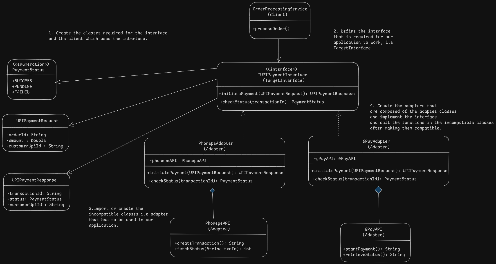

# Adapter Pattern Design - Payment Gateway

# Overview
- Allows objects with incompatible interfaces to collaborate by converting the interface of one class into another that is used in the client.

# Problem
- Compatibility issue between different applications such as third party or legacy systems.

# Solution
- Adapter is a special object that is used to convert the interface of incompatible application into another object compatible with existing client application.
- Existing object calls the same methods as the existing interface and adapter does the translation internally.
- Adapter implements the existing interface that the client uses.
- Adapter calls incompatible service after converting the request into a format compatible for it.
- Two ways adapters are also possible in some scenarios.

# Applicability
- Adapter class can be used when we want to use an existing incompatible class with our existing application.

# Implementation
1. Declare the client interface and implement the client to use the interface.
2. Create the adapter classes that implement the client interface.
3. Add a reference to the incompatible(adaptee) class in the adapter class and initialize it in constructor or pass it when calling methods.
4. For each method in the interface implement it by calling the incompatible service after translating the request of the interface.e.

# Benefits and Pitfalls
Benefits:
- Single Responsibility Pattern: Conversion to make interfaces compatible is separated from the business logic.
- Open/Closed Principle: Adapters are open for extension without breaking client code as client is not coupled to the adapter and only uses the interface.

Pitfalls:
- Overall complexity increases because of new interfaces and adapter classes, sometimes it might be easier to change the service according to the client.

# Relation with Other Patterns
- No other structual patterns covered till now.