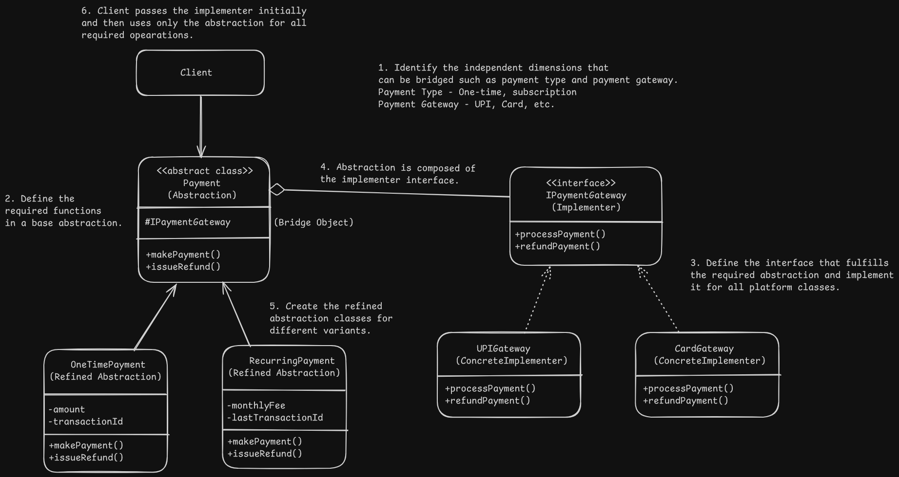

# Bridge Pattern Design - Payment Gateway

# Overview
- It allows to split a large class or closely related classes into two different dimensions, where one is abstraction which acts as a high-level control layer and delegates the work to the other which is the implementation/platform which does the actual work and both can be developed independently.

# Problem
- Creating/expanding closely related classes of similar objects leads to exponential number of classes.

# Solution
- Switch from inheritance to composition.
- The dimensions can be extracted into implementation and abstraction which holds an object reference to the implementation.

# Applicability
- It can be used to organise and divide classes that have several variants of some functionality.
- When a class has to be extended into several orthogonal (independent) dimensions.
- When abstraction might work with different implementations which might switch at runtime. (Similar to strategy* pattern but optional in bridge).

# Implementation
1. Identify different independent dimensions in the classes such as abstraction/implementation, domain/infrastructure, frontend/backend, interface/implementation.
2. Define the required operations used by the client in a base abstraction class.
3. Determine the operations available in all the platforms. Declare the one's required by the abstraction in an interface.
4. Implement the concrete implementation of the interface for all platforms.
5. Define a reference to the implementation interface in the base abstraction class.
6. Client passes the implementation object to the abstractions initially and then deals with the abstraction only to fulfill all operations.

# Benefits and Pitfalls
Benefits:
- It helps in creating platform independent classes and apps.
- Client code works with high level abstraction and isn't coupled with the platform level details.
- Open/Closed Principle: New abstractions and implementations can be added independently.
- Single Responsibility Principle: High level logic resides in abstractions and platform details in implementation.

Pitfalls:
- Applying to highly cohesive (classes that work well together) can lead to more complicated code.

# Relation with Other Patterns
- Bridge is upfront and promotes independent development of different parts whereas adapter is used with existing applications to ensure compatibility.
- Bridge is structurally similar to (strategy*, state*) pattern and some similarity with Adapter pattern and follows composition and delegation of work but each pattern solves a different problem.
- Bridge can be used with abstract factory when some abstractions only work with specific implementations. The client only deals with the factory which in turn deals with the abstractions and provides it the required implementation that works with it and the abstraction then gets the work done with that implementation.
- Builder pattern (Set of steps(Multiple Builders) + Director), where the director class acts as the abstraction and different builders as the implementations.
- *(yet to be covered)