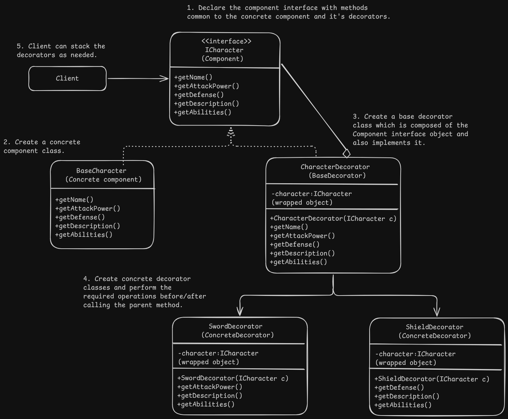

# Decorator Pattern Design - Game Character

# Overview
- It allows to attach new behaviours to objects by creating special wrapper classes that contain the additional behaviours and a reference to the object it is decorating.

# Problem
- Extending the functionality of a class by subclassing or forming various combination of functionalities leads to huge number of classes.

# Solution
- A wrapper is an object that contains reference to another object (composition of target object or wrapped object) to which it adds additional behaviours. Wrapper object also has the same set of methods as the wrapped object and delegates most of the work to the wrapped object.
- Wrapper can modify the behaviour of the method by doing something either before/after passing the request to the wrapped object.
- The client can use the decorator classes same as the original classes since all of them implement the same component interface and extends the behaviour by adding additional functionality apart from calling the parent method.

# Applicability
- When you need to assign extra behaviour to the objects at runtime without breaking the existing code using those objects.
- When extending an object behaviour through subclasses is not possible or leads to huge number of classes.

# Implementation
1. Find the methods that are common to both base component and the optional decorators and declare those methods in a component interface.
2. Create a concrete component class and implement the base interface methods.
3. Create a base decorator class either as abstract or normal class and have a reference to the interface object to delegate the work. The reference can either be a base component or another decorator.
4. The decorator class implements in interface is also composed of the interface reference.
5. Create concrete decorator classes as subclasses of the base decorator and perform the required extended actions before/after calling the parent methods of the wrapped object. 
6. Client code stacks the decorators as required to the base object.

# Benefits and Pitfalls
Benefits:
- Objects behaviour can be extended without making new subclasses.
- Responsibilities can be added/removed from an object at runtime.
- Several different behaviours can be combined by wrapping multiple decorators.
- Single Responsibility Principle : Monolithic classes with many possible behaviours can be divided into several smaller classes.

Pitfalls:
- Extracting an exact wrapper from the wrapper stack is difficult as an object only knows about the object it wraps.
- Behaviour depends on the order in the decorator stack.
- Initial configuration code of layers might be ugly.

# Relation with Other Patterns
- Adapter changes the interface of an existing object while decorator enhances it's behaviour without changing the interface. Decorator supports recursive composition while adapter doesn't.
- Adapter provides a different interface to the wrapped object whereas decorator provides the wrapped object with an enhanced interface.
- Composite and Decorator both have similar structures as they both rely on recursive composition.
    - A decorator is like a composite but it has only one child component while composite holds a list of children objects.
    - Decorator adds additional responsibilities to the object it wraps whereas composite sums up the result from all the wrapped children objects.
    - Decorator can be used to extend the behaviour of a specific object in the composite tree as both implement the same interface. The composite object can be passed to the decorator class which extends it's behaviour.
- Designs that use composite or decorator pattern can benefit from the prototype pattern to clone complex structures instead of re-constructing them from scratch.