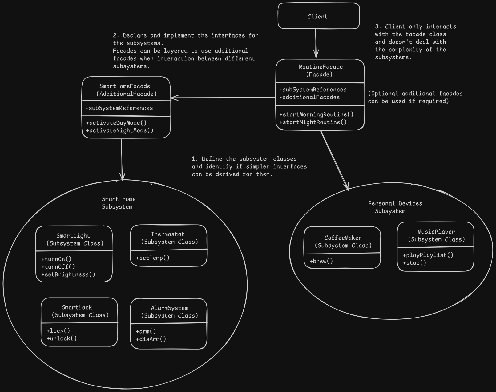

# Facade Pattern Design - Home Automation

# Overview
- It provides a simplified interface to a library, framework or any other complex set of classes or subsystems.

# Problem
- Business logic should not get coupled with the implementation details of third-party libraries or underlying complex subsystems.

# Solution
- A facade is a class that provides a simple interface to a complex system with a lot of moving parts.
- It provides only the features that the client really needs.

# Applicability
- Use the facade pattern when you want to have a limited but straight-forward interface to a complex subsystem.
- When we want to structure subsystems into layers where each subsytem communicates with the other through facades.

# Implementation
1. Verify if a simpler interface can be derived as per the client and it hides many subsystem classes.
2. Declare and implement this interface in a new facade class which calls the respective subsystems as needed and manages their initializtion and lifecycle if not done by the client.
3. Make the client use only the facade class to interact with the subsystem.
4. Make refined facades if the facade class becomes too big.

# Benefits and Pitfalls
Benefit:
- It isolates the client code from the complexity of the subsystem.

Pitfall:
- The facade class may a god class as it gets coupled with a lot of different classes.

# Relation with Other Patterns
- Facade defines a new interface for existing objects whereas adapter tries to the make the existing interface compatible with the object that it wraps. Adapter wraps just one object whereas facade works with an entire subsystem of objects.
- Abstract factory can serve as a facade when we only want to hide the subsystem object creation from the client.
- A facade class can be a singleton since one facade object is sufficient in most cases.