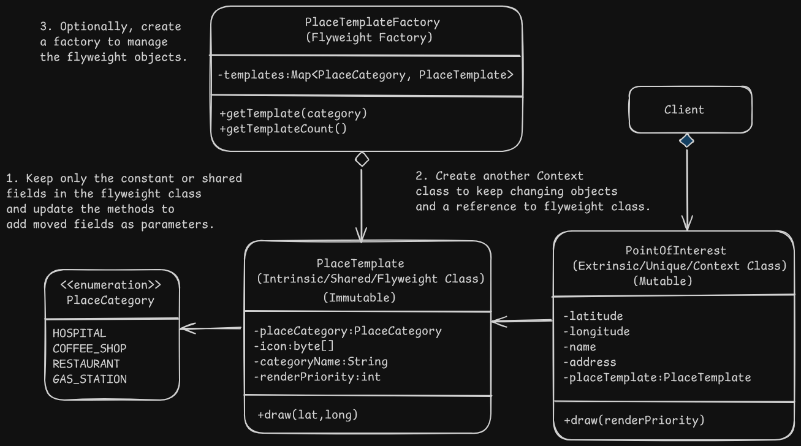

# Flyweight Pattern Design - Maps application objects (Ex - Places in Google Maps)

# Overview
- This pattern lets us efficiently share the common state (same value high memory consuming fields) across multiple objects instead of duplicating it in every object to reduce RAM usage and boost the performance.

# Problem
- Storing same high memory consuming value in many different object instances leading to high memory usage.

# Solution
## Background
    - The constant/repeating state of an object is called the intrinsic state.
    - The changing/unique state of an object is called the extrinsic state.
- An object that only stores the intrinsic data is called a flyweight.
- Move the extrinsic data of the object to a seperate object and store a reference to the flyweight object.
- The flyweight object is reused in different contexts as multiple context objects can share the same flyweight object.
- The extrinsic values which are moved out of the class should be passed to the methods that need them while invoking them through the reference object.
- Flyweight objects should be immutable as they are shared and should be initialized only once in the constructor and shouldn't expose and public fields or setters.
- A flyweight factory can store/retrieve the flyweight objects using it's intrinsic state and if not found create it and add it to the pool.
- The factory can be created as a static class inside flyweight class or as a method or as a separate class.

# Applicability
- When the program creates a huge number of objects which contain duplicated states which can be extracted and shared.

# Implementation
1. Divide the fields of the object into intrinsic/constant and extrinsic/unique states.
2. Leave the intrinsic fields in the class and make sure they are immutable and only initialized by the constructor.
3. Refine the methods in the class which use the extrinsic state and add those values as parameters.
4. Optionally, create a flyweight factory to manage the pool of flyweight objects and create them as required.
5. Client must store the extrinsic objects or use the context class which has the extrinsic states and a reference to the flyweight object. 

# Benefits and Pitfalls
Benefit:
- A lot of RAM can be saved when creating tons of similar objects.

Pitfalls:
- If the changing state needs to be recalculated everytime when calling the flyweight method, it might lead to more CPU usage.
- It might be confusing as code becomes complicates and object states are scattered into separate classes.

# Relation with Other Patterns
- Shared leaf objects of composite trees can be implemented as flyweight to save RAM.
- Flyweight shows how to make a lot of little objects while facade shows how to make a single object represent an entire subsystem.
- Flyweight class would resemble singleton if all shared state of the objects are in one flyweight object, but flyweight differs as below:
    - Singleton should only have one instance, whereas flyweight can have multiple instances with different intrinsic values.
    - Singleton object can be mutable while flyweight object should be immutable.
