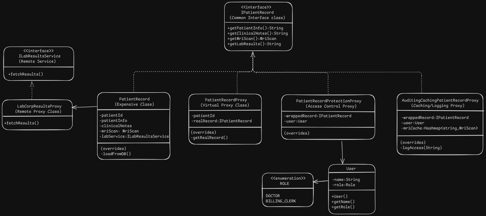

# Proxy Pattern Design - Hospital Patient Record Management

# Overview
- It allows to provide a substitute or placeholder for another object. The control of the real object lies with the proxy which allows to perform actions either before/after the request goes to the original object.

# Problem
- Dealing with resource intensive objects/classes that might not be required everytime or adding extra functionality such as caching, logging, authentication, etc. without modifying the original class.

# Solution
- Create a proxy that implements the same interface as the original service and pass the proxy object to all original object clients.
- On receiving a request from the client, create the real service and delegate the work as required.

# Applicability
- Lazy Initialization (Virtual Proxy) - When a heavy object wastes system resources by being always up, even though it might only be needed from time to time.
- Access Control (Protection Proxy) - When we want to limit the access of the real service only to specific clients.
- Remote Execution (Remote Proxy) - When the service object is located on a remote server and we want to access it like a local object while delegating the extra responsibilities like network calls to the proxy class.
- Logging Requests (Logging Proxy) - When we need to keep a history of the requests to the service.
- Caching Requests (Caching Proxy) - When we need to cache results of the client requests and manage the lifecycle of the cache, especially if the results are quite large.
- Smart Reference - When we need to manage the heavyweight objects and delete it if no client is using it or reuse it if the other client has not modified the real service object.

# Implementation
1. If there is no pre-existing interface, try to create one but it might not always be possible to extract an interface. In worst case make the proxy class a subclass of the service class to inherit the interface.
2. Create the proxy class(es) with a reference to the real service with the above interface object and mostly the proxy class manages the lifecycle of the real object but on rare occasions if might be passed to the proxy class constructor.
3. Implement the methods and delegate the work to the real service as required and perform required actions before/after this call.
4. An optional creation method can be created to decide whether real object should be passed or proxy object as a static method or as a full-blown factory.
5. Mostly the real expensive object should be lazily initialized.

# Benefits and Pitfalls
Benefits:
- More control over the real service objects and their lifecycles without client involvement.
- Proxy works even if the service object isn't ready or not available.
- Open/Closed Principle : New proxies can be added without changing the service/clients.

Pitfalls:
- Code complexity increases and response from the service might get delayed.

# Relation with Other Patterns
- Adapter provides a different interface to the wrapped object, proxy provides with the same interface and decorator provides it with an enhanced interface.
- Facade is similar to proxy as it also buffers a complex entity and initializes it on it's own but proxy has a same interface while facade doesn't so the objects are not interchangable.
- Decorator and proxy have similar structures but very different intent/use-case. Both are based on delegation to the wrapped object and stack different objects as needed but proxy also manages the life cycle of the whereas decorators composition is managed by the client.